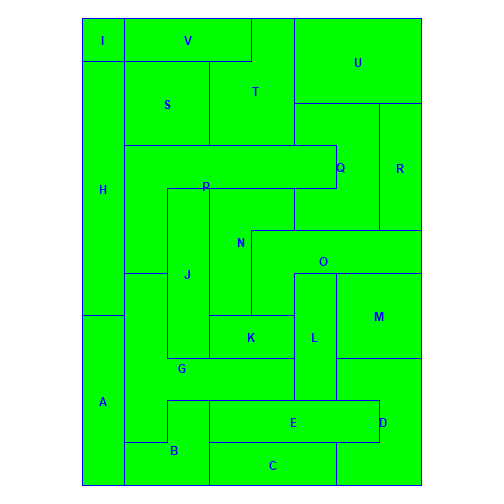
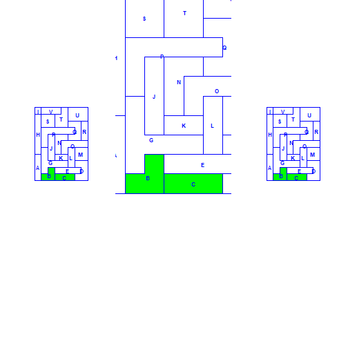
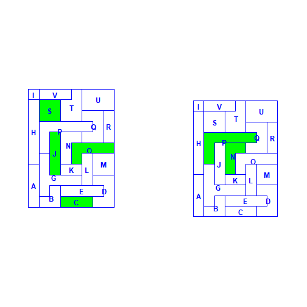
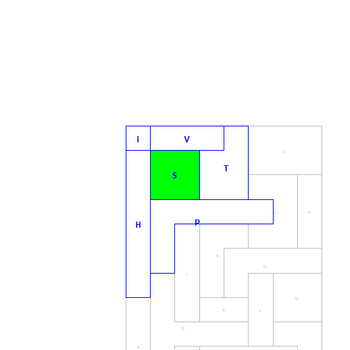
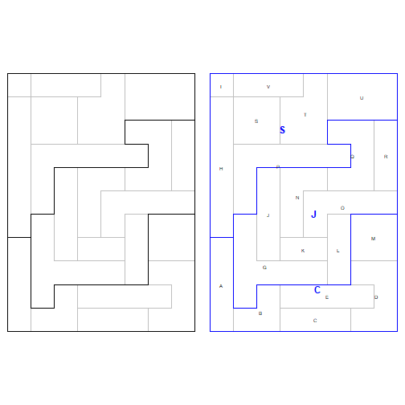
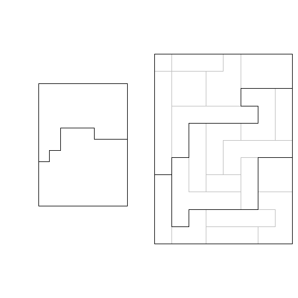

<!-- 
README.md is generated from README.Rmd. Please edit that file 
Rather than clicking the knit button in RStudio, run knitr::knit("README.Rmd"), otherwise figures go elsewhere (base.dir appears to be ignored)
-->

```{r, echo = FALSE}
knitr::opts_knit$set(base.dir = "man",
                     collapse = TRUE,
                     fig.show = "hide")
```


# HSAr - Automated HSA delineation through R

## Introduction

Hospital service areas (HSAs) are often used in healthcare analyses, particularly for studying variation in rates, cost and quality. Rather than being tied to geopolitical regions (such as counties, states or cantons), HSAs are defined using patient movement and thus reflect patients usage patterns.

Originally described in the 1970's [@Wennberg1973], the classical approach to defining HSAs has changed little since then and involves some highly subjective decisions, and the method is thus not reproducible. `HSAr` is an attempt to create a reproducible method to create HSAs using the open access R language (as such it's use is not hampered by pay walls and only a modest knowledge of R should suffice to use it).

This method is described in a paper provisionally accepted at Health Services Research.

## Installation
### R itself

R is available from [CRAN](https://cran.r-project.org). I also recommend [RStudio](http://www.rstudio.com), which provides alot of functionality to aid working with R.

### Installing HSAr from github with devtools

```{r, eval = FALSE}
devtools::install_github("aghaynes/HSAr")
```

## Using HSAr
### Load the package
The package is loaded in the normal manner for R packages. I also recommend setting `stringsAsFactors` to `FALSE` as this frequently causes unexpected behaviour. 
```{r, echo = TRUE, warning=FALSE, message=FALSE}
library(HSAr)
options(stringsAsFactors = FALSE)
```

### Load your datafiles

Two types of data are required for `HSAr`

  1.  a shapefile defining the spatial relationship between regions
  2.  source and destination of individuals

#### Spatial data
There are many ways to get shapefiles into R. A common one is using the `rgdal` package which can read OGR datafiles (e.g. ESRI shapefiles).

```{r, eval = FALSE}
library(rgdal)
file <- system.file("extdata", "shape.shp", package = "HSAr")
shape <- readOGR(dirname(file), "shape", stringsAsFactors = FALSE)
# the map can be viewed with the plot function
plot(shape) 
```

Whichever way you choose to use to get your spatial data into R, it needs to be a SpatialPolygonsDataFrame object (as opposed to a sf object). If you have an sf type object, `as(x, "Spatial")` can be used.

`HSAr` has an example shapefile which can be loaded via
```{r shape_example, fig.show = "hide"}
data(shape)
plot(shape)
```


The rownames of the spatial data should be consistent with the names in the patient data. It is normally necessary to do this after importing the shapefile from an ESRI file. 
```{r}
shape <- spChFIDs(shape, shape$reg) # not necessary in this case, but this is how you could do it
```


#### Patient/flow data
There are also numerous ways to get tabular data into R. See e.g. `read.csv` (from the `utils` package), the functions in the `readr` (similar file types to the `utils` package), `readxl`, `openxlsx` (for excel data) and/or `haven` (for datasets in SPSS, Stata or SAS formats) packages. 

```{r, eval = FALSE}
flowdata <- read.csv("path_to_data.csv")
# have a look at the contents
# head(flowdata)
```

```{r, echo = FALSE}
data(flow)
```


A demo dataset is included in the package, containing the home and hospital locations of `r nrow(flow)` patients what live in the region contained in the `shape` shapefile above.
```{r, eval = FALSE}
data(flow)
```

```{r}
head(flow)
table(flow$from) # where they live
table(flow$to) # where they received care
```

There are patients travelling from `r length(unique(flow$from))` to `r length(unique(flow$to))` regions. Note that there are `r length(shape)` regions in the shapefile, so no one from `r length(shape) - length(unique(flow$from))` regions were hospitalized. 


It is possible to summarize the patient flows using the `flows` function, which provides details of the number of patients moving between regions and the proportions of the regions that the given number of patients represents.
```{r}
f <- flows(flow$from, flow$to)
head(f)
```

We see that 26 people move from A to C (65% of those in A and 8% of those that go to C). Ranks are also provided (most from A go to C - rank is 1 - and A represents the 5th most people going to C).

#### Exploring maps
`HSAr` also provides a functions for exploring maps. You might want to look at a specific HSA for example. The `minimap` function allows you to zoom into a given HSA (or more generally, a polygon in a shapefile) by providing suitable a regular expression to identify it (see `?regex`). The selected regions are highlighted in green.

```{r minimap_example1, fig.show = "hide"}
# Show all regions
minimap(shape)
```

```{r minimap_example2, fig.show = "hide"}
# Show region B
minimap(shape, polygon = "B")
```

```{r minimap_example3, fig.show = "hide"}
# Show region B or C
par(mfrow = c(1,3))
minimap(shape, polygon = "B|C")
# equivalently, minimap(shape, polygon = "[BC]")
# changing the zoom is also possible, which is particularly useful for larger maps
minimap(shape, polygon = "B|C", zoomout = .01)
minimap(shape, polygon = "B|C", zoomout = .5)

```




For our example, we could look at which regions have hospitals (or at least receive patients; left), and which receive no patients (right):
```{r minimap_to_missing, fig.show = "hide"}
par(mfrow = c(1,2))
minimap(shape, polygon = paste(unique(flow$to), collapse = "|"), zoomout = 0)
minimap(shape, polygon = paste(shape$reg[!shape$reg %in% flow$from], collapse = "|"), zoomout = .75)
```


#### Generating HSAs
The goal of `HSAr` is to make the generation of HSAs quick and easy. The `gen_hsa` (generate HSAs) function is the main work-horse of the package. It iteratively looks at each region which receives patients, identifies the neighbours and merges them with the hospital region if most flow is in that direction. It will keep doing that until it has allocated all regions. 


<details><summary>Specific details (click to expand)</summary>

```{r, echo = FALSE}
n <- gTouches(shape, byid = TRUE, returnDense = FALSE)
h <- "S"
on <- n[[h]]
on <- shape$reg[on]
w <- f$to == h & f$from %in% on
f2 <- f[w, c("from", "to", "N", "rank_from")]
```

As an example, if we look at region `r h`, the algorithm identifies the neighbours (`r paste(on, collapse = ", ")`), then finds looks at from which most patients go to the focal hospital (`r paste(f2$from, collapse = ", ")`) and lumps those regions together with the hospital for the next iteration (remember that P has no patients, so that region doesn't appear in the flows, which are basically just cross tabulations).

```{r flow_details, echo = FALSE, fig.show = "hide"}
minimap(shape[shape$reg %in% c(h, on), ], shape, polygon = h, zoomout = 2)
f2
```


The next iteration for hospital S then looks at regions neighbouring S+H+I+V+T and merges them if most patients go to S (or another hospital within S+H+I+V+T, if that should be the case), which might be region U. In this way, HSAs grow organically around the hospitals.

Once no more changes are necessary, the algorithm will check that each "proto-HSA" is valid - that it meets the requirements of having a high enough localization index (proportion of people remaining in the HSA, defaults to 0.5 = 50%) and number of interventions (defaults to 10). At this point, regions without patients would fail both of these tests and the algorithm estimates the regions flow based on the flows of the neighbours. In this case, it is allocated to S.

```{r, echo = FALSE}
h <- "P"
on <- n[[h]]
on <- shape$reg[on]
w <- f$from %in% on
f2 <- f[w, c("from", "to", "N", "rank_from")]
agg <- aggregate(N ~ to, f2, sum)
agg[order(agg$N, decreasing = TRUE), ]
```

Proto-HSAs that do have patients, but fail either due to low LI or number of intervention are merged with the proto-HSA receiving most flow.

Once this has been done, the algorithm starts again to ensure that no more HSAs should be merged and all HSAs are valid.

</details>

By default, `gen_hsa` prints the number of HSAs at each iteration (as it can take some time to run) and will plot a map of the current allocations at the beginning of each iteration. The number of iterations required depends the number of regions. It will also warn about missing regions. For instance, we see that two regions in the shape file do not exist as sources, and 17 do not exist as destinations.
```{r generate, fig.show = "hide", collapse = TRUE}
par(mfrow = c(2,4))
hsas <- gen_hsa(shp = shape, from = flow$from, to = flow$to)
```


Summary, plot and minimap methods exist for the returned hsa object, making it easy to view the results. 

```{r summary, fig.height=3, fig.show = "hide"}
par(mfrow = c(1,3))
summary(hsas, plot = TRUE)
```


Most important here are the localization index and number of interventions sections at the end. The plot option can be used to show three figures depicting the number of regions at each iteration of the loop and the number of interventions and localization index in the resulting HSAs. Options `li` and `n_interv` will also return these numbers in a table. 

Both plot and minimap methods show the regions making up the HSAs as well as the HSAs themselves (in grey), but minimap adds labels to the map.

```{r plotmethods, fig.show = "hide"}
par(mfrow = c(1,2))
plot(hsas)
minimap(hsas)
```


The final shapefile and a lookup table to assign regions to HSAs are accessed via
```{r}
hsa_shape <- hsas$shp
hsa_lookup <- hsas$lookup
```

These files can then be saved for later use in R or other software.

#### A clustering based approach

A clustering based approach to creating hospital regions was published by [@delamater2013], together with code for its implementation. A modified version is provided here, as it is discussed in the provisionally accepted paper. Where original method used hospital beds and staffing to define the similarity among hospitals, we use the distance between regions and the patient flows. The method uses a two-step K-means and Wards clustering approach to first derive the best number of clusters (HSAs) and then assign regions to a cluster. Compared to the more classical approach, this method can produce very different results and might be better for cases where there are already more distinct regions in the data (e.g. fewer, larger hospitals which have natural catchment areas, rather than cases where there are many hospitals with largely overlapping catchments). The example data provided in the package, for example, was designed to produce three HSAs, which it does using the method above. Using the cluster-based approach it produces only two HSAs.

Besides using the distance between the regions to define the similarity, we also made two other changes to the original implementation:

  1. The original method for identifying the number of clusters does not perform well when there are few hospitals. A second approach is provided through the `peak` argument which can take values of `dela` (short for delamater) or `diff` (which is the R function used in the implementation, short for difference). If the default setting produces an error, try the other setting, as in the example below.
  2. As with the HSAr method above, the cluster based approach cannot allocate regions without flow to a HSA. As above, we have implemented the same filling algorithm here. To turn it off, set the `fill` option to `FALSE`.


```{r cluster, fig.show = "hide"}
chsas <- gen_hsa_clust(shp = shape, from = flow$from, to = flow$to, max_clusters = 21, peaks = "diff")
par(mfrow = c(1,2))
plot(chsas$shp)
plot(hsas)
```



# References

<div id="refs" class="references">

<div id="ref-delamater2013">

Delamater, Paul L., Ashton M. Shortridge, and Joseph P. Messina. 2013.
“Regional Health Care Planning: A Methodology to Cluster Facilities
Using Community Utilization Patterns.” *BMC Health Services Research* 13
(1):333. <https://doi.org/10.1186/1472-6963-13-333>.

</div>

<div id="ref-Wennberg1973">

Wennberg, John, and Alan Gittelsohn. 1973. “Small Area Variations in
Health Care Delivery.” *Science* 182.
<https://doi.org/10.1126/science.182.4117.1102>.

</div>

</div>
