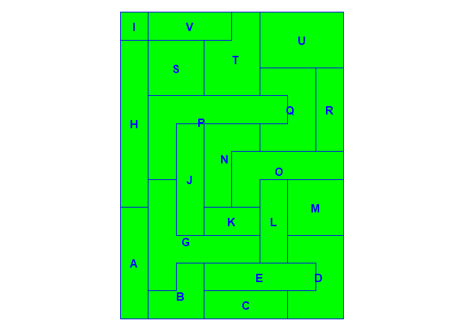
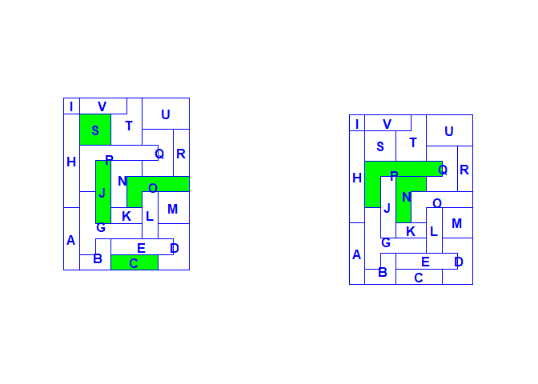

<!-- README.md is generated from README.Rmd. Please edit that file -->

# HSAr - Automated HSA delineation through R

## Introduction

Hospital service areas (HSAs) are often used in healthcare analyses,
particularly for studying variation in rates, cost and quality. Rather
than being tied to geopolitical regions (such as counties, states or
cantons), HSAs are defined using patient movement and thus reflect
patients usage patterns.

Originally described in the 1970’s (Wennberg and Gittelsohn 1973), the
classical approach to defining HSAs has changed little since then and
involves some highly subjective decisions, and the method is thus not
reproducible. `HSAr` is an attempt to create a reproducible method to
create HSAs using the open access R language (as such it’s use is not
hampered by pay walls and only a modest knowledge of R should suffice to
use it).

This method is described in a paper provisionally accepted at Health
Services Research.

## Installation

### R itself

R is available from [CRAN](https://cran.r-project.org). I also recommend
[RStudio](http://www.rstudio.com), which provides alot of functionality
to aid working with R.

### Installing HSAr from github with devtools

``` r
devtools::install_github("aghaynes/HSAr")
```

## Using HSAr

### Load the package

``` r
library(HSAr)
```

### Load your datafiles

Two types of data are required for `HSAr`: 1. a shapefile defining the
spatial relationship between regions 2. source and destination of
individuals

#### Spatial data

There are many ways to get shapefiles into R. A common one is using the
`rgdal` package which can read OGR datafiles (e.g. ESRI shapefiles).

``` r
library(rgdal)
file <- system.file("extdata", "shape.shp", package = "HSAr")
shape <- readOGR(dirname(file), "shape", stringsAsFactors = FALSE)
# the map can be viewed with the plot function
plot(shape) 
```

Whichever way you choose to use to get your spatial data into R, it
needs to be a SpatialPolygonsDataFrame object (as opposed to a sf
object). If you have an sf type object, `as(x, "Spatial")` can be used.

`HSAr` has n example shapefile which can be loaded via

``` r
data(shape)
plot(shape)
```

<!-- -->

The rownames of the spatial data should be consistent with the names in
the patient data. It is normally necessary to do this after importing
the shapefile from an ESRI
file.

``` r
shape <- spChFIDs(shape, shape$reg) # not necessary in this case, but this is how you could do it
```

#### Patient/flow data

There are also numerous ways to get tabular data into R. See e.g.
`read.csv` (from the `utils` package), the functions in the `readr`
(similar file types to the `utils` package), `readxl`, `openxlsx` (for
excel data) and/or `haven` (for datasets in SPSS, Stata or SAS formats)
packages.

``` r
flowdata <- read.csv("path_to_data.csv")
# have a look at the contents
# head(flowdata)
```

A demo dataset is included in the package

``` r
data(flow, package = "HSAr")
head(flow)
```

    ##   from to
    ## 1    I  J
    ## 2    I  O
    ## 3    I  J
    ## 4    I  O
    ## 5    I  S
    ## 6    I  S

``` r
table(flow$from)
```

    ## 
    ##   A   B   C   D   E   G   H   I   J   K   L   M   O   Q   R   S   T   U 
    ##  40 100  66  67  82  44  67  42  34  56  59  20  48  98  67  78  89  91 
    ##   V 
    ##  30

``` r
table(flow$to)
```

    ## 
    ##   C   J   O   S 
    ## 318 321 184 355

There are patients travelling from 19 to 4 regions. Note that there are
21 regions in the shapefile, so no one from 2 regions were hospitalized.

It is possible to summarize the patient flows using the `flows`
function, which provides details of the number of patients moving
between regions and the proportions of the regions that the given number
of patients represents.

``` r
f <- flows(flow$from, flow$to)
head(f)
```

    ##   from to  N N_from N_to prop_from     prop_to rank_from rank_to
    ## 1    A  C 26     40  318      0.65 0.081761006         1       5
    ## 2    A  J 10     40  321      0.25 0.031152648         2      15
    ## 3    A  O  2     40  184      0.05 0.010869565         3      19
    ## 4    A  S  2     40  355      0.05 0.005633803         4      18
    ## 5    B  C 55    100  318      0.55 0.172955975         1       1
    ## 6    B  J 27    100  321      0.27 0.084112150         2       2

We see that 26 people move from A to C (65% of those in A and 8% of
those that go to C). Ranks are also provided (C receives most from A -
rank is 1 - and A represents the 5th most people going to C).

#### Exploring maps

`HSAr` also provides a functions for exploring maps. You might want to
look at a specific HSA for example. The `minimap` function allows you to
zoom into a given HSA (or more generally, a polygon in a shapefile) by
providing suitable regular expression to identify it (see `?regex`). The
selected regions are highlighted in green.

``` r
# Show all regions
minimap(shape)
```

<!-- -->

``` r
# Show region P
minimap(shape, polygon = "B")
```

<!-- -->

``` r
# Show region P or J
par(mfrow = c(1,3))
minimap(shape, polygon = "B|C")
# equivalently, minimap(shape, polygon = "[PJ]")
# changing the zoom is also possible, which is particularly useful for larger maps
minimap(shape, polygon = "B|C", zoomout = .01)
minimap(shape, polygon = "B|C", zoomout = 1)
```

<!-- -->

For our example, we could look at which regions have hospitals (or at
least receive patients), and which receive no patients:

``` r
par(mfrow = c(1,2))
minimap(shape, polygon = paste(unique(flow$to), collapse = "|"), zoomout = 0.1)
minimap(shape, polygon = paste(shape$reg[!shape$reg %in% flow$from], collapse = "|"), zoomout = 1)
```

<!-- -->

We can also check which regions had no patients

#### Generating HSAs

The goal of `HSAr` is to make the generation of HSAs quick and easy. the
`gen_hsa` function is the main work-horse of the package. By default, it
will plot a map of the current allocations at the beginning of each
iteration. The number of iterations depends the number of regions.

``` r
par(mfrow = c(2,4))
hsas <- gen_hsa(shp = shape, from = flow$from, to = flow$to)
```

    ## Warning: 2 regions in 'shp' not in 'from'. 
    ## Warning: 17 regions in 'shp' not in 'to'.

    ## Iterating
    ## ....

    ##  11 
    ## ....

    ##  7 
    ## ...

    ##  6 
    ## ...

    ##  3 
    ## ...

    ##  3

    ## 
    ## HSAs produced 3

``` r
summary(hsas)
```

    ## Criteria
    ##    Localization Index (LI) threshold:    0.4 
    ##    Minimum interventions:                10 
    ## Iterations required to satisfy criteria: 5 
    ## 
    ## Shapefile
    ## Number of regions in original shapefile: 21
    ## 'shp' regions not in 'from' (2): 
    ## N P
    ## 'shp' regions not in 'to' (17): 
    ## N P
    ## 'from' regions not in 'shp' (0): 
    ## 
    ## 'to' regions not in 'shp' (0): 
    ## 
    ## HSAs generated (3):
    ## C J S
    ## Regions assigned to HSAs via:
    ##         Var1 Freq
    ##  destination    3
    ##         flow   15
    ##    neighbour    3
    ## 
    ## 
    ## Localization Index
    ##    Min. 1st Qu.  Median    Mean 3rd Qu.    Max. 
    ##  0.5600  0.5770  0.5940  0.5950  0.6125  0.6310 
    ## 
    ## Interventions
    ##    Min. 1st Qu.  Median    Mean 3rd Qu.    Max. 
    ##   318.0   336.5   355.0   392.7   430.0   505.0

<!-- -->

Summary, plot and minimap methods exist for the returned hsa object,
making it easy to view the results. Both plot and minimap methods show
the regions making up the HSAs as well as the HSAs themselves (in grey),
but minimap adds labels to the map.

``` r
par(mfrow = c(1,3))
summary(hsas, plot = TRUE)
```

    ## Criteria
    ##    Localization Index (LI) threshold:    0.4 
    ##    Minimum interventions:                10 
    ## Iterations required to satisfy criteria: 5 
    ## 
    ## Shapefile
    ## Number of regions in original shapefile: 21
    ## 'shp' regions not in 'from' (2): 
    ## N P
    ## 'shp' regions not in 'to' (17): 
    ## N P
    ## 'from' regions not in 'shp' (0): 
    ## 
    ## 'to' regions not in 'shp' (0): 
    ## 
    ## HSAs generated (3):
    ## C J S
    ## Regions assigned to HSAs via:
    ##         Var1 Freq
    ##  destination    3
    ##         flow   15
    ##    neighbour    3
    ## 
    ## 
    ## Localization Index
    ##    Min. 1st Qu.  Median    Mean 3rd Qu.    Max. 
    ##  0.5600  0.5770  0.5940  0.5950  0.6125  0.6310 
    ## 
    ## Interventions
    ##    Min. 1st Qu.  Median    Mean 3rd Qu.    Max. 
    ##   318.0   336.5   355.0   392.7   430.0   505.0 
    ## 
    ## Creating 3 plots

<!-- -->

Most important here are the localization index and number of
interventions sections at the end. The plot option can be used to show
three figures depicting the number of regions at each iteration of the
loop and the number of interventions and localization index in the
resulting HSAs. Options `li` and `n_interv` will also return these
numbers in a table.

``` r
par(mfrow = c(1,2))
plot(hsas)
minimap(hsas)
```

<!-- -->

The final shapefile and a lookup table to assign regions to HSAs are
accessed via

``` r
hsa_shape <- hsas$shp
hsa_lookup <- hsas$lookup
```

These files can then be saved later use in R or other software.

# References

<div id="refs" class="references">

<div id="ref-Wennberg1973">

Wennberg, John, and Alan Gittelsohn. 1973. “Small Area Variations in
Health Care Delivery.” *Science* 182.
<https://doi.org/10.1126/science.182.4117.1102>.

</div>

</div>
